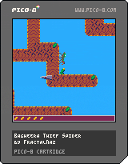

# pico-spider
It is a small pico8 source code game about a [Bagheera kiplingi spider](https://en.wikipedia.org/wiki/Bagheera_kiplingi) looking to steal leaf fruit (beltian bodies) from ants that guard the tree.

## Bagheera Thief Spider
It is the oficial public name of the game.

_Look for the leaf fruits, and avoid the ants and thorns in this retro style 8bit game._

